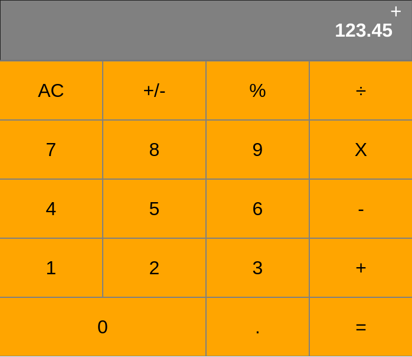

# react-calc

A fully functional web-based calculator written in React. It supports basic arithmetic operations.

## Live version

- [Live version](https://iid-react-calc.herokuapp.com/) 
  
## Running the app locally
You can always run the app through the live version linked on a previous section. But if you'd like to run it locally, follow the instructions below:

- Gettnng the files
First, you need to have the files on your computer. You can get them by either cloning this repository, or downloading its contents directly

To clone the repository, go on the project's Github page, click on "Clone or download", copy the contents of the text box, and then run git clone "repo" on the command line, where "repo" is the text you just copied.
If you want to download it directly instead, go on the project's Github page, click on "Clone or download", and then on "Download ZIP". After this, you need to extract the contents of the zip file on your computer.

- Installing dependencies
Now you need to open a terminal and navigate to the project's directory. Once there, run the command `npm install`. This is going to fetch and install all the dependencies for the app.

Running the app
Once that's done, run the command `npm start`. That should open a new browser window with the app. If the browser does not open, do it manually, paste this on the url box: localhost:3000, and press enter.

## Built With
  - create-react-app
  - React

## Author

👤 **Ivan Diaz**

  - Github: [@ivanid22](https://github.com/ivanid22)
  - Twitter: [@ivanid22](https://twitter.com/ivanid22)
  - Linkedin: [Ivan Diaz](www.linkedin.com/in/ivanid22)

## 🤝 Contributing

  - Contributions, issues and feature requests are welcome!

  - Feel free to check the [issues page](./issues).

## Show your support

  - Give a ⭐️ if you like this project!
  